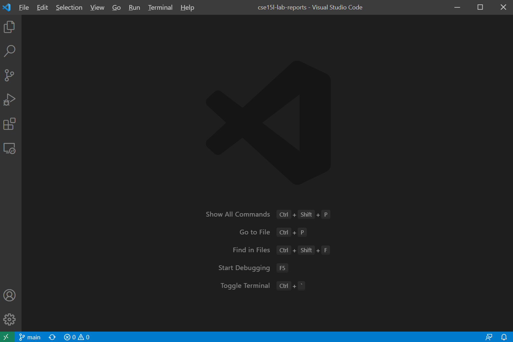
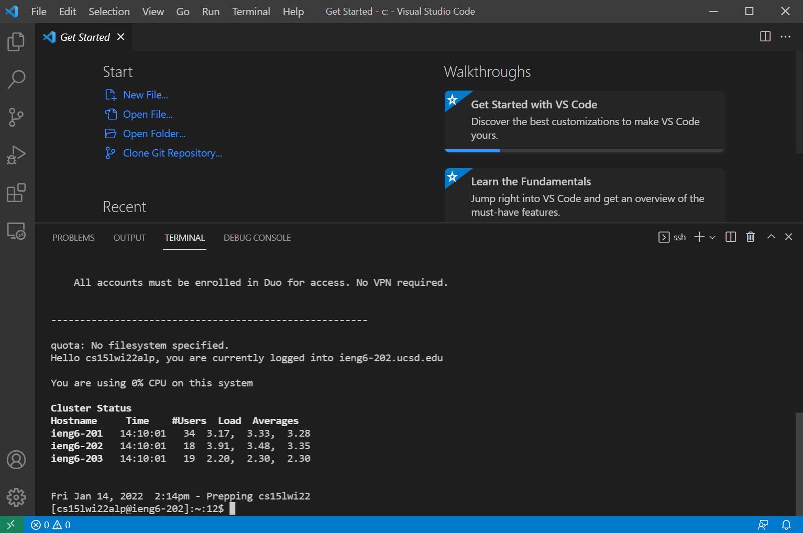
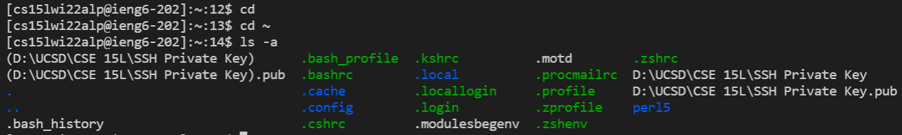

# CSE 15L Lab Report 1

Step 1: Installing VScode

1. search “VScode” on google.
2. Click “Download” under the result “Visual Studio Code - Code Editing. Redefined.”
3. Download VScode.

Step 2: Remotely Connecting

1. Install OpenSSH server and OpenSSH client in the Windows setting.
2. Open the terminal in VScode as an administrator.
3. Change the password of the CSE 15L course account and wait until the password is activated.
4. Start and configure OpenSSH server and then connect to OpenSSH server.

Step 3: Trying Some Commands

1. After connected to the OpenSSH server, you can input commands such as “cd” and “ls -a.”
