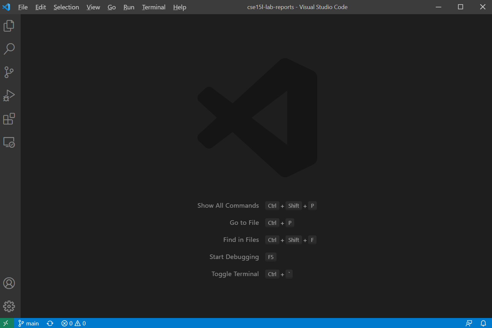
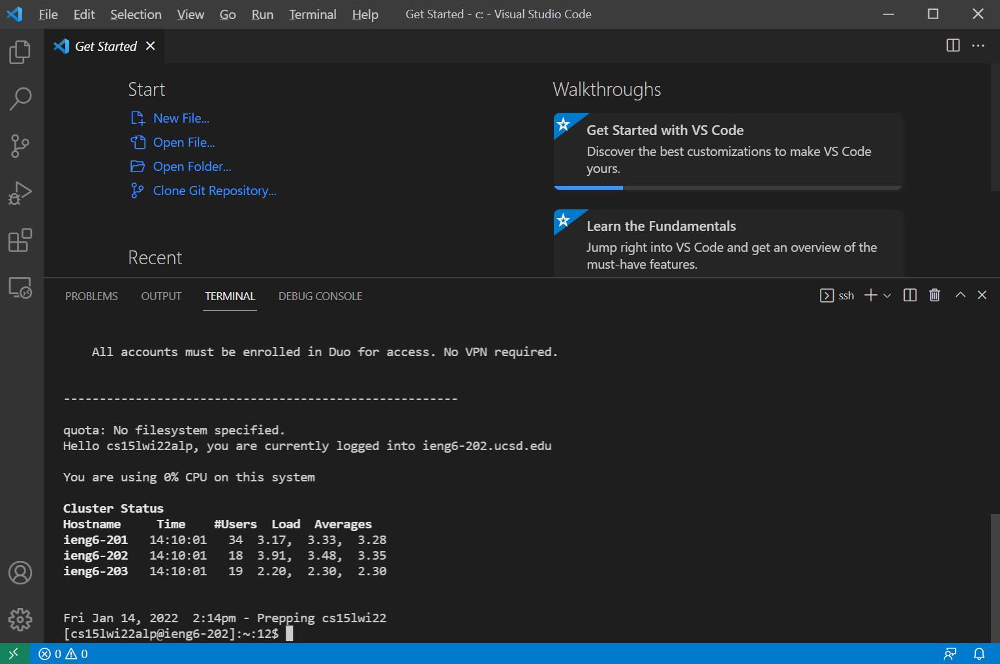
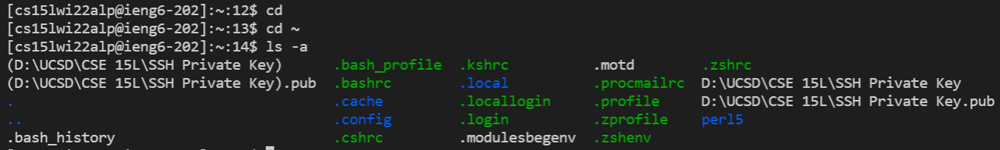
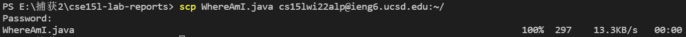
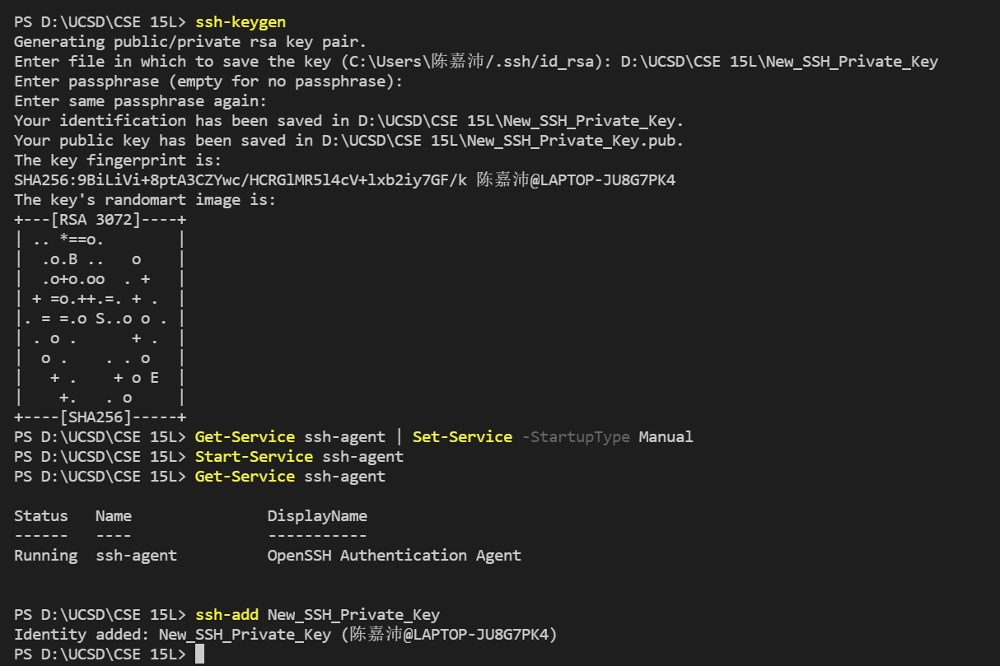
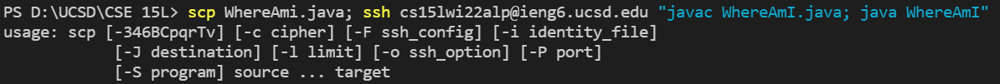
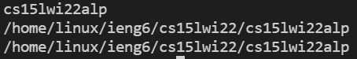

# CSE 15L Lab Report 1

Step 1: Installing VScode

1. search “VScode” on google.
2. Click “Download” under the result “Visual Studio Code - Code Editing. Redefined.”
[Click this link to download VsCode](https://code.visualstudio.com/download)
3. Download VScode.

Step 2: Remotely Connecting

1. Install OpenSSH server and OpenSSH client in the Windows setting.
2. Open the terminal in VScode as an administrator.
3. Change the password of the CSE 15L course account and wait until the password is activated.
4. Start and configure OpenSSH server and then connect to OpenSSH server.

Step 3: Trying Some Commands

1. After connected to the OpenSSH server, you can input commands such as “cd” and “ls -a.”

Step 4: Moving Files with scp

1. Exit OpenSSH server, then enter the scp command to upload the file you want to upload. Make sure that the file is in the same repository.

Step 5: Setting an SSH Key

1. Enter the command ssh-keygen. Then set a location where you can store the key. The generate the key.
2. After that, enter the following commands as an administrator and then ssh-add the key.

Step 6: Optimizing Remote Running

1. Enter a series of command to copy the file to the server and run the file on the server. In this way, we can save time when trying to run remotely.
Then you will see the file is copied to the server. Entering this command takes 23 keystrokes.

2. After than you can see the file can successfully run on the server.
