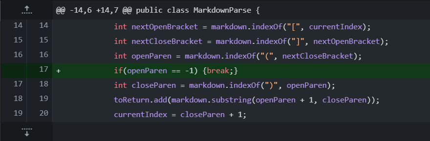
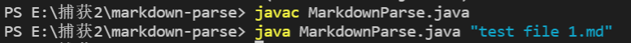
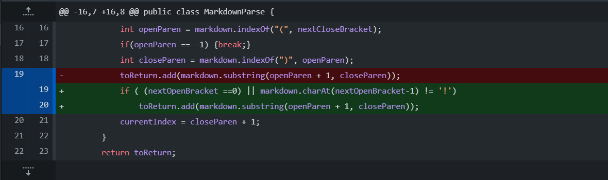
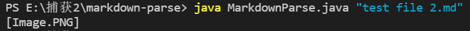
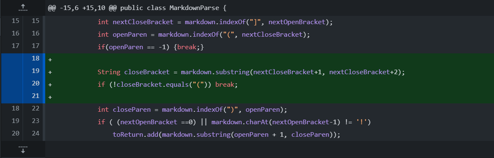
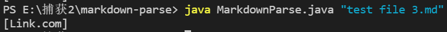

# CSE 15L Lab Report 2

**Code Change 1:**

Code Difference From Github

[Link to Test File 1](test file 1.md)

The Output of Running the File at the Command Line for the First Version Where It is Failing

> The input of test file 1 includes a line in which the open parenthesis is before the close bracket rather than after the close bracket. The Symptom here is when running the programme, the programme falls into a dead loop. The bug is in the getLinks method in the MarkdownParse class, where the programme doesn't stop the method from running when the index of open parenthesis is -1, which will cause the index of currentIndex be always at the index of the close bracket and thus currentIndex is always smaller than the length of the Arraylist. As a result, the while loop will go on forever. Since the open parenthesis in the line in test file 1 is before the close parenthesis and the close parenthesis is before the close bracket, the index of open parenthesis given by the indexOf method searching from the index of the close bracket in the getLinks methods is -1, which correspond to the case described about the bug above, which causes the symptom.

**Code Change 2:**

Code Difference From Github

[Link to Test File 2](test file 2.md)

The Output of Running the File at the Command Line for the Second Version Where It is Failing

> The input is a line that gives a link to an image that starts with an exclamation mark. The Symptom here is when running the programme, the programme extracts the link of an image, which doesn't correspond to the programme's original purpose, which is extracting a link that is not the link of an image. The bug is in the getLinks method in the MarkdownParse class, where the programme doesn't recognize the exclamation mark before the open bracket and deal with the link of an image as a normal link. 

**Code Change 3:**

Code Difference From Github

[Link to Test File 3](test file 3.md)

The Output of Running the File at the Command Line for the Third Version Where It is Failing

> The input is a line of link in which there is an "/" character between the close bracket and the open parenthesis. The Symptom is the programme extracts the link inside the parenthesises because the format of the line is not correct. There shouldn't be any characters between the close bracket and the open parenthesis. The bug in the getLinks method in the MarkdownParse class is the method looks for the open parenthesis after the close bracket while it doesn't confirm that there is no character between them. Since the input has a charatcer "/" between the close bracker and the open parenthesis, and the method doesn't check it, the programme just extracts the link between the parenthesis even though the format of this line is not correct.

