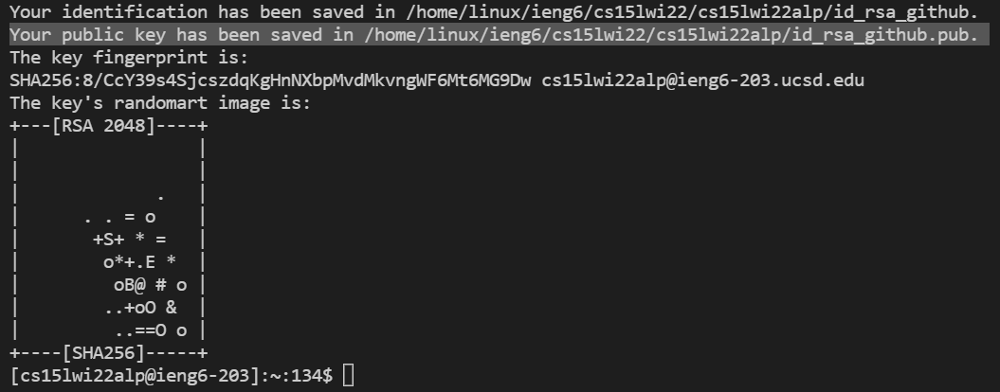
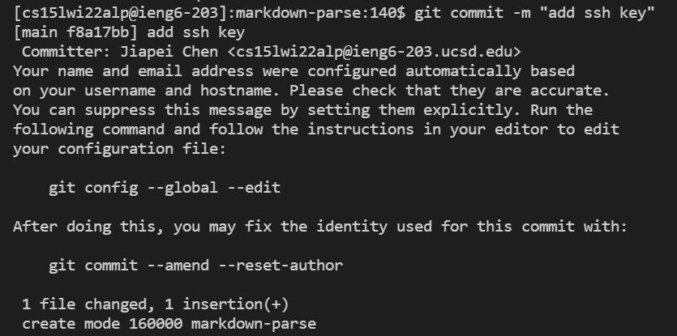
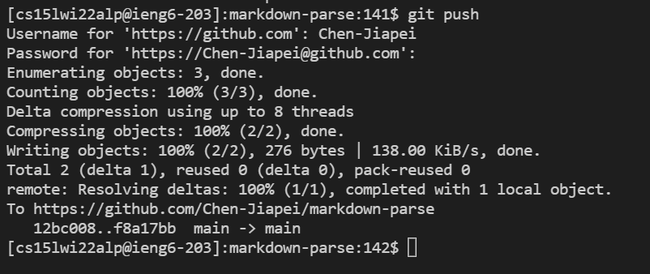

# CSE 15L Lab Report 3

**Part 1.**

The public key I made is stored on my user account as the following:

**Part 2.**
The private key I made is stored on my user account as the following:

**Part 3.**

Running git command to commit a change

Running git command to push a change

**Part 4.**

The link to the result commit

[Link to the Result Commit](https://github.com/Chen-Jiapei/markdown-parse/commit/f8a17bbecb2a40c3059f5ae13f555c56d19b6875)