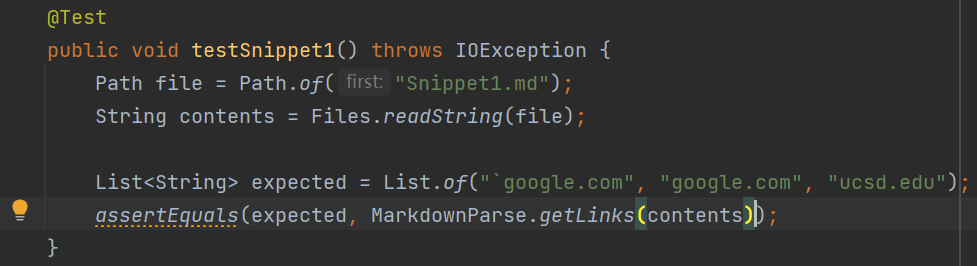
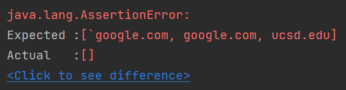
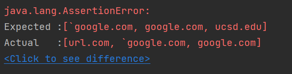
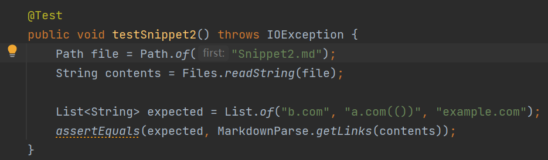
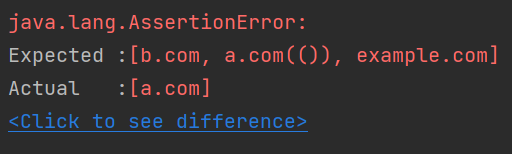
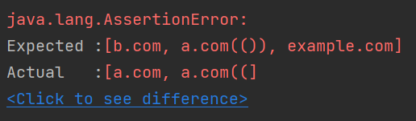
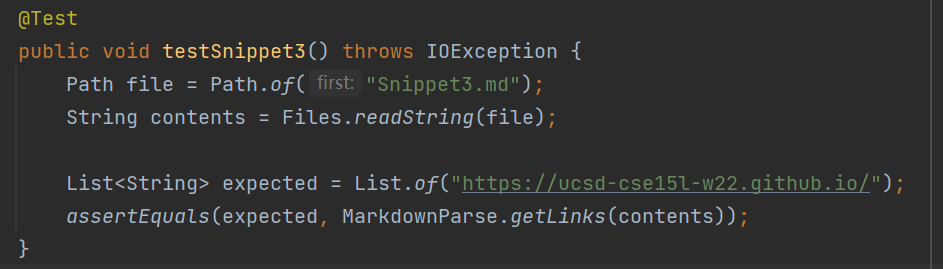
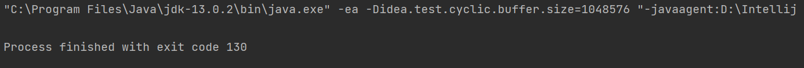
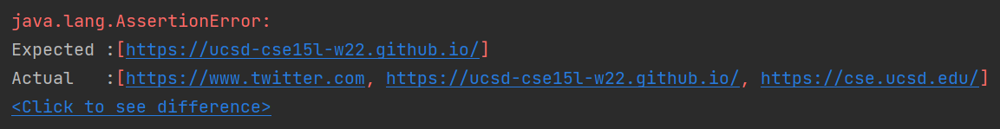

# CSE 15L Lab Report 4

Link to my markdown-parse repository:
[My MarkdownParse](https://github.com/Chen-Jiapei/markdown-parse)

Link to the markdown-parse repository I reviewed:
[Reviewed MarkdownParse](https://github.com/vs2961/markdown-parse)

**Snippet 1**

1. Expected Output

```
[`google.com, google.com, ucsd.edu]
```

2. Code of MarkdownParseTest for Snippet 1



3. Testing My MarkdownParse with Snippet 1

    The test didn't pass.



4. Testing the MarkdownParse I reviewed with Snippet 1

    The test didn't pass.



**Snippet 2**

1. Expected Output

```
[b.com, a.com(()), example.com]
```

2. Code of MarkdownParseTest for Snippet 2



3. Testing My MarkdownParse with Snippet 2

    The test didn't pass.



4. Testing the MarkdownParse I reviewed with Snippet 2

    The test didn't pass.



**Snippet 3**

1. Expected Output

```
[https://ucsd-cse15l-w22.github.io/]
```

2. Code of MarkdownParseTest for Snippet 3



3. Testing My MarkdownParse with Snippet 3

    The test didn't pass and it falls into a dead loop.



4. Testing the MarkdownParse I reviewed with Snippet 3

    The test didn't pass.



**Answers to Questions About Code Change**

1. Question: Do you think there is a small (<10 lines) code change that will make your program work for snippet 1 and all related cases that use inline code with backticks? If yes, describe the code change. If not, describe why it would be a more involved change.


No, I don't think so. There are a lot of problems in my MarkdownParse. The first problem is the getlink method will stop working when it finds an illegal link. The second problem is the method won't add a link to the toReturn list if the open bracket of the link is not at index 0, even if it is a legal link. The third problem is the program has never considered the problem of the character "'". Therefore, to solve these problems, it will need changes more than ten lines.


2. Question: Do you think there is a small (<10 lines) code change that will make your program work for snippet 2 and all related cases that nest parentheses, brackets, and escaped brackets? If yes, describe the code change. If not, describe why it would be a more involved change.


No I don't think so. There is a serious problem reflected by the output of the Snippet 2. The program won't detect the pairs of open brackets and close brackets in the link. Therefore, to solve this problem, it will need chanegs more than ten lines.


3. Question: Do you think there is a small (<10 lines) code change that will make your program work for snippet 3 and all related cases that nest parentheses, brackets, and escaped brackets? If yes, describe the code change. If not, describe why it would be a more involved change.


No I don't think so. There are serious problems. The first problem is the program keeps searching for open bracket after the last close parenthesis in the string but the current index is not at the length of the string. The second problem is the program can't determine a link to be illegal when there is more than one "\n". The third problem is the program don't know that there isn't a closing parethesis if there is another link behind the link. Therefore, to solve these problem, it will need chanegs more than ten lines.

