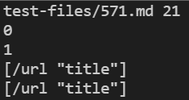
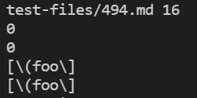

# CSE 15L Lab Report 5

I found tests with different results manually. 

**Test 571**

Result of Lab 9 Implementation:

Result of My Implementation:

The implementation in Lab 9 is correct, and my implementation is wrong.

My implementation didn't correctly recognize the exclamation mark before the link. What needs to be done is fixing the if statement for returning the link.

**Test 494**

Result of Lab 9 Implementation:

Result of My Implementation:

The implementation in Lab 9 is correct, and my implementation is wrong.

My implementation can't correctly recognize the close parenthesis in the link, as a result, it won't print out the complete link.

