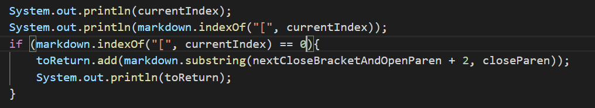

# CSE 15L Lab Report 5

I found tests with different results manually. 

**Test 571**

Result of Lab 9 Implementation:


Result of My Implementation:


The implementation in Lab 9 is correct, and my implementation is wrong.



My implementation didn't correctly recognize the exclamation mark before the link. What needs to be done is fixing the if statement for returning the link.

In the code, I accidentally forgot to adjust the if statement and caused the problem. The following code should be added to the conditional statement of the if statement.

```
!markdown.substring(nextOpenBracket - 1, nextOpenBracket).equals("!") ||
!markdown.substring(nextOpenBracket - 1, nextOpenBracket).equals("'")
```

**Test 494**

Result of Lab 9 Implementation:


Result of My Implementation:


The implementation in Lab 9 is correct, and my implementation is wrong.


My implementation can't correctly recognize the close parenthesis in the link, as a result, it won't print out the complete link.

In the code, the problem is the indexOf method can only find the first close parenthesis it finds, therefore it will neglect the remaining close parenthesis and goes on to find the next open bracket.

